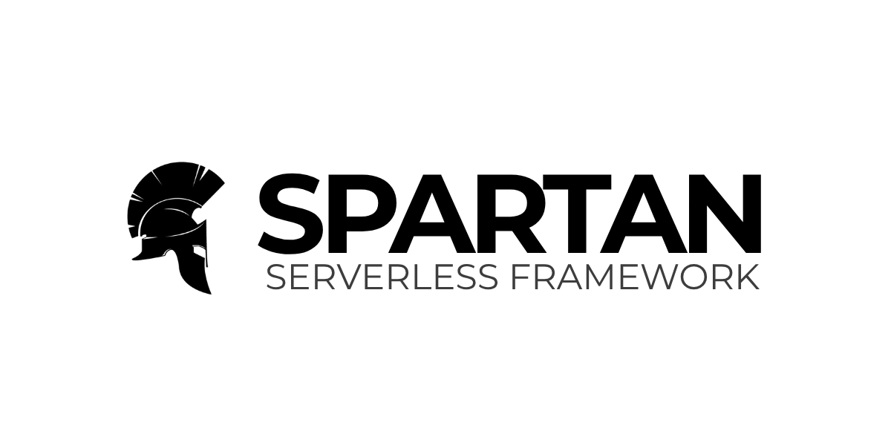

<p align="center"></p>

# Lazaro

## About
Lazaro is a structured serverless framework for building scalable Python applications on Google Cloud Platform. Based on the Spartan Serverless Framework, it focuses exclusively on GCP with consistent structure and first-class integrations for APIs, event-driven workloads, and ETL pipelines.

---

## Features

| **Feature Category**           | **Status**                   | **Details**                                                  |
| ------------------------------ | ---------------------------- | ------------------------------------------------------------ |
| **Google Functions Framework** | ✅ Excellent                  | GCP-native CloudEvent support, event-driven, typed functions |
| **Pydantic Integration**       | ✅ Full Support               | Validation, serialization, EmailStr, type safety             |
| **Architecture Patterns**      | ✅ Robust                     | Service pattern, clean separation of concerns                |
| **Testing Framework**          | ✅ Fully Integrated           | pytest, mocking, coverage tools                              |
| **Code Quality Tools**         | ✅ Complete                   | Black, isort, flake8, mypy, bandit, pre-commit               |
| **Development Workflow**       | ✅ Streamlined                | Poetry, Tox, environment support                             |
| **Cloud-Native Features**      | ✅ Advanced                   | Tasks, secrets, parameter manager, multi-cloud hooks         |
| **Observability & Monitoring** | ✅ Enterprise-Grade           | Structured logging, tracing, exception handling              |
| **Developer Experience**       | ✅ High                       | Docker, Serverless Framework, Terraform, .env support                              |
| **Security Best Practices**    | ✅ Strong                     | Hashing, input validation, secrets handling                  |
| **Scalability Features**       | ✅ Built-in                   | Pagination, filtering, bulk operations                       |
| **Logging Support**            | ✅ Advanced                   | Factory logger types (file, stream, GCP), structured output  |
| **GCP Cloud Logging**          | ✅ Fully Integrated           | Trace context, severity levels, resource detection           |
| **Structured Logs**            | ✅ JSON + Metadata            | PII redaction, function source, custom metadata              |
| **Observability Hooks**        | ✅ Extensible                 | Factory patterns for loggers/tracers, sampling               |
| **Reusability**                | ✅ High                       | Abstract base classes, reusable modules                      |
| **Modular Architecture**       | ✅ Excellent                  | Factory design, reusable services/utilities                  |
| **Configuration Management**   | ✅ Centralized                | Pydantic + .env + environment-detection                      |
| **Cross-Platform Support**     | ✅ Multi-Cloud Ready          | GCP, AWS, local support via abstraction layers                |
| **Code Consistency**           | ✅ Consistent with minor gaps | Naming conventions, model structures, unified patterns       |

---

## Installation & Usage

1. **Install the Spartan CLI tool:**
```bash
pip install python-spartan
```

2. **Try it out:**
```bash
spartan --help
```

3. **Set up your environment:**

<details>
<summary><strong>▶️ For Linux / macOS</strong></summary>

```bash
python -m venv .venv
source .venv/bin/activate
pip install -r requirements-dev.txt
```

</details>

<details>
<summary><strong>🪟 For Windows PowerShell</strong></summary>

```powershell
python -m venv .venv
.venv\Scripts\Activate.ps1
pip install -r requirements-dev.txt
```

</details>

<details>
<summary><strong>🪟 For Windows CMD / DOS</strong></summary>

```cmd
python -m venv .venv
.venv\Scripts\activate.bat
pip install -r requirements-dev.txt
```

</details>

4. **Copy and configure environment variables:**

```bash
cp .env.example .env  # Linux/macOS
```

```powershell
copy .env.example .env  # PowerShell
```

```cmd
copy .env.example .env  # CMD
```

---

## Running the Application

### Option 1: Run directly with Python
```bash
python main.py
```

### Option 2: Run with Functions Framework
```bash
functions-framework --target=main
```

---

## Sending a Test CloudEvent

You can test the endpoint using `curl` once the app is running (default: `localhost:8080`):

```bash
curl -X POST localhost:8080 \
  -H "Content-Type: application/cloudevents+json" \
  -d '{
    "specversion" : "1.0",
    "type" : "google.cloud.pubsub.topic.v1.messagePublished",
    "source" : "//pubsub.googleapis.com/projects/my-project/topics/my-topic",
    "subject" : "123",
    "id" : "A234-1234-1234",
    "time" : "2018-04-05T17:31:00Z",
    "data" : "Hello Spartan Lazaro!"
}'
```

### Deploy to Google Cloud Functions

Deploy your function to GCP:

```bash
# Deploy as HTTP function
gcloud functions deploy spartan-function \
  --runtime python311 \
  --trigger-http \
  --entry-point main \
  --allow-unauthenticated

# Deploy as Pub/Sub triggered function
gcloud functions deploy spartan-function \
  --runtime python311 \
  --trigger-topic my-topic \
  --entry-point main
```

---

## Testing

Run the test suite using `pytest`:

```bash
pytest -vv
```

---

## Changelog

Please see [CHANGELOG](CHANGELOG.md) for recent updates.

---

## Contributing

Please see [CONTRIBUTING](./docs/CONTRIBUTING.md) for details on contributing.

---

## Security Vulnerabilities

Please review [our security policy](../../security/policy) for how to report vulnerabilities.

---

## Credits

- [Sydel Palinlin](https://github.com/nerdmonkey)
- [All Contributors](../../contributors)

---

## License

The MIT License (MIT). Please see the [License File](LICENSE) for more information.
